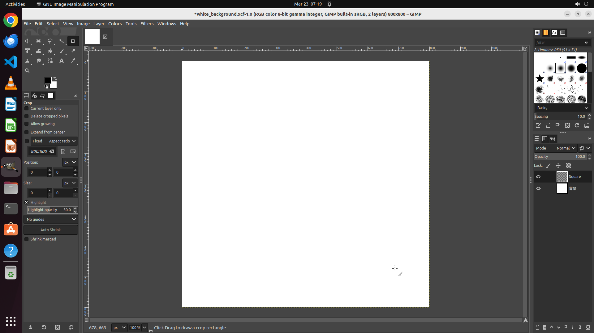

# Could you assist me in adding a new layer and naming it 'Square'?

[← GIMP](../README.md) · [← Showcase](../../README.md)

## Task

> Could you assist me in adding a new layer and naming it 'Square'?

## Final state

## Artifacts

- [▶ Screen recording](recording.mp4) — full agent run
- [Trajectory](traj.jsonl) — per-step actions, reasoning, and screenshots
- [Runtime log](runtime.log)
- [Task definition](task.json) — original OSWorld task config
- Step screenshots: `step_*.png` in this folder

Task ID: `b148e375-fe0b-4bec-90e7-38632b0d73c2` · Domain: `gimp` · Source: `https://www.quora.com/How-do-I-add-layers-in-GIMP`
