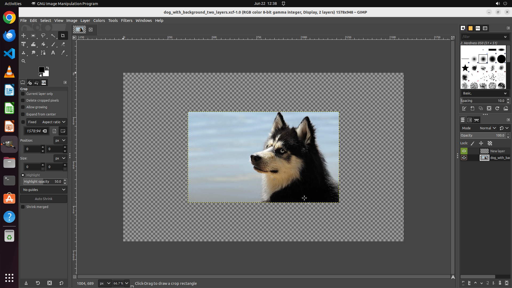

# Could you assist me with resizing the dog layer of an image? I need to adjust the height to 512 pixe…

[← GIMP](../README.md) · [← Showcase](../../README.md)

## Task

> Could you assist me with resizing the dog layer of an image? I need to adjust the height to 512 pixels while maintaining the original aspect ratio?

## Final state

## Artifacts

- [Trajectory](traj.jsonl) — per-step actions, reasoning, and screenshots
- [Runtime log](runtime.log)
- [Task definition](task.json) — original OSWorld task config
- Step screenshots: `step_*.png` in this folder

Task ID: `d16c99dc-2a1e-46f2-b350-d97c86c85c15` · Domain: `gimp` · Source: `https://stackoverflow.com/questions/75185543/use-gimp-to-resize-image-in-one-layer-only`
