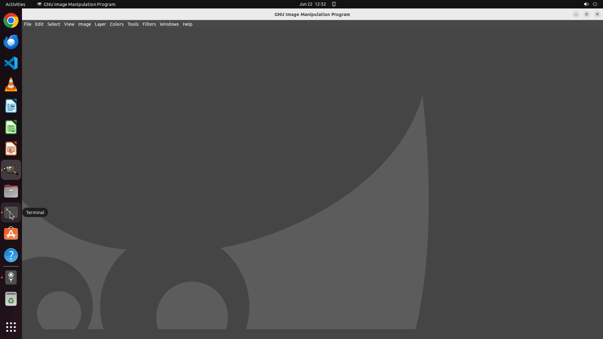

# Could you help me remove the dock on the left side of the screen in the GIMP?

[← GIMP](../README.md) · [← Showcase](../../README.md)

## Task

> Could you help me remove the dock on the left side of the screen in the GIMP?

## Final state

## Artifacts

- [Trajectory](traj.jsonl) — per-step actions, reasoning, and screenshots
- [Runtime log](runtime.log)
- [Task definition](task.json) — original OSWorld task config
- Step screenshots: `step_*.png` in this folder

Task ID: `d52d6308-ec58-42b7-a2c9-de80e4837b2b` · Domain: `gimp` · Source: `https://superuser.com/questions/1447106/how-to-get-rid-of-the-gimp-tool-options-box`
