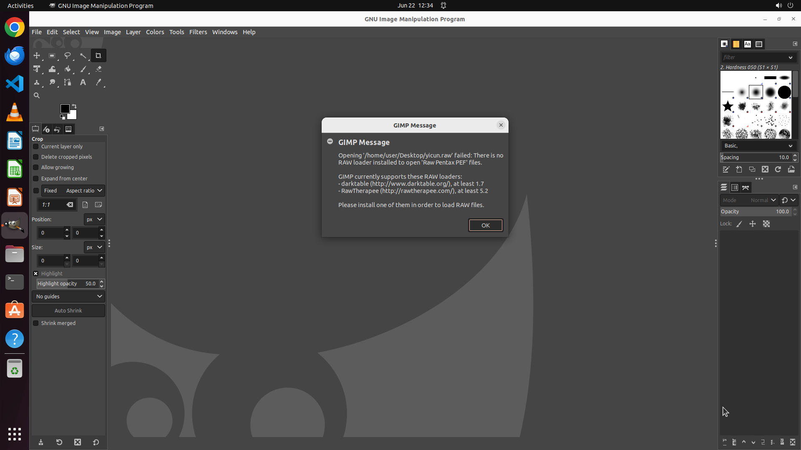

# Use GIMP only to convert my new RAW image into a JPEG file.

[← GIMP](../README.md) · [← Showcase](../../README.md)

## Task

> Use GIMP only to convert my new RAW image into a JPEG file.

## Final state

## Artifacts

- [Trajectory](traj.jsonl) — per-step actions, reasoning, and screenshots
- [Runtime log](runtime.log)
- [Task definition](task.json) — original OSWorld task config
- Step screenshots: `step_*.png` in this folder

Task ID: `dbbf4b99-2253-4b10-9274-45f246af2466` · Domain: `gimp` · Source: `https://www.makeuseof.com/tag/can-photoshop-gimp-cant/`
