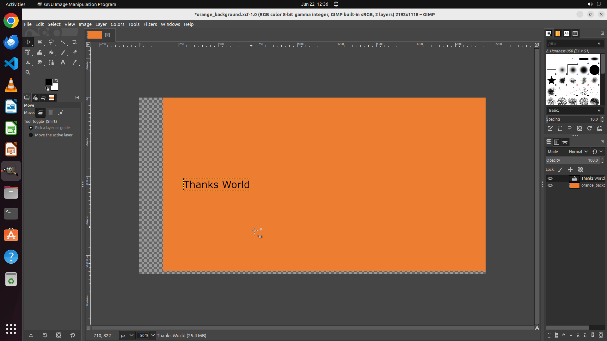

# Can you assist me in shifting the text box to the left? I keep accidentally selecting the image laye…

[← GIMP](../README.md) · [← Showcase](../../README.md)

## Task

> Can you assist me in shifting the text box to the left? I keep accidentally selecting the image layer beneath it.

## Final state

## Artifacts

- [Trajectory](traj.jsonl) — per-step actions, reasoning, and screenshots
- [Runtime log](runtime.log)
- [Task definition](task.json) — original OSWorld task config
- Step screenshots: `step_*.png` in this folder

Task ID: `e2dd0213-26db-4349-abe5-d5667bfd725c` · Domain: `gimp` · Source: `https://superuser.com/questions/839650/how-to-move-an-inserted-text-box-in-gimp`
