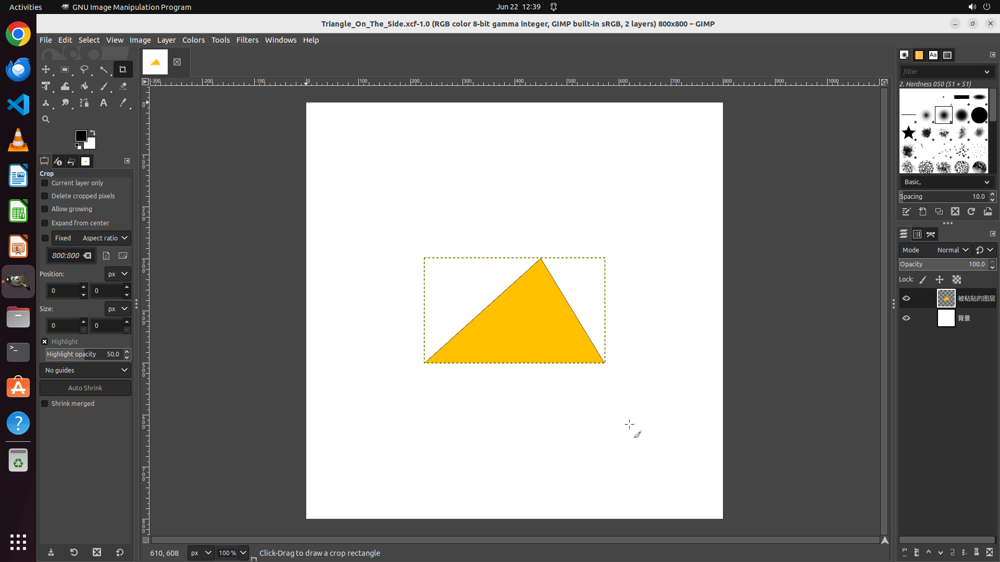

# Help me choose the yellow triangle and positioning it at the center of my picture.

[← GIMP](../README.md) · [← Showcase](../../README.md)

## Task

> Help me choose the yellow triangle and positioning it at the center of my picture.

## Final state

## Artifacts

- [Trajectory](traj.jsonl) — per-step actions, reasoning, and screenshots
- [Runtime log](runtime.log)
- [Task definition](task.json) — original OSWorld task config
- Step screenshots: `step_*.png` in this folder

Task ID: `f4aec372-4fb0-4df5-a52b-79e0e2a5d6ce` · Domain: `gimp` · Source: `https://superuser.com/questions/612338/how-do-i-select-and-move-an-object-in-gimp`
