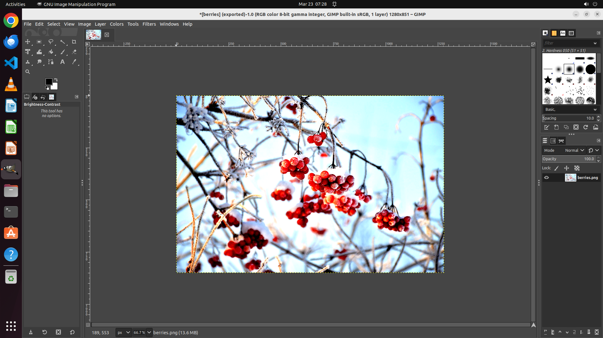

# I'd like to make the picture's contrast stronger to really bring out the main subject. Could you ass…

[← GIMP](../README.md) · [← Showcase](../../README.md)

## Task

> I'd like to make the picture's contrast stronger to really bring out the main subject. Could you assist me in boosting the contrast?

## Final state

## Artifacts

- [▶ Screen recording](recording.mp4) — full agent run
- [Trajectory](traj.jsonl) — per-step actions, reasoning, and screenshots
- [Runtime log](runtime.log)
- [Task definition](task.json) — original OSWorld task config
- Step screenshots: `step_*.png` in this folder

Task ID: `f723c744-e62c-4ae6-98d1-750d3cd7d79d` · Domain: `gimp` · Source: `https://www.reddit.com/r/GIMP/comments/12e57w8/how_to_use_gimp_to_exaggerate_contrast/`
