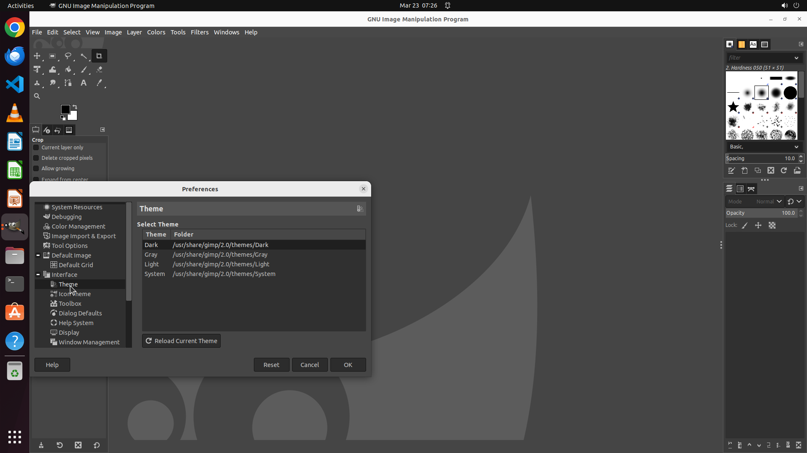

# Blue is my favorite color, so could you help me change the color theme of GIMP to "Blue"?

[← GIMP](../README.md) · [← Showcase](../../README.md)

## Task

> Blue is my favorite color, so could you help me change the color theme of GIMP to "Blue"?

## Final state

## Artifacts

- [▶ Screen recording](recording.mp4) — full agent run
- [Trajectory](traj.jsonl) — per-step actions, reasoning, and screenshots
- [Runtime log](runtime.log)
- [Task definition](task.json) — original OSWorld task config
- Step screenshots: `step_*.png` in this folder

Task ID: `fbb548ca-c2a6-4601-9204-e39a2efc507b` · Domain: `gimp`
