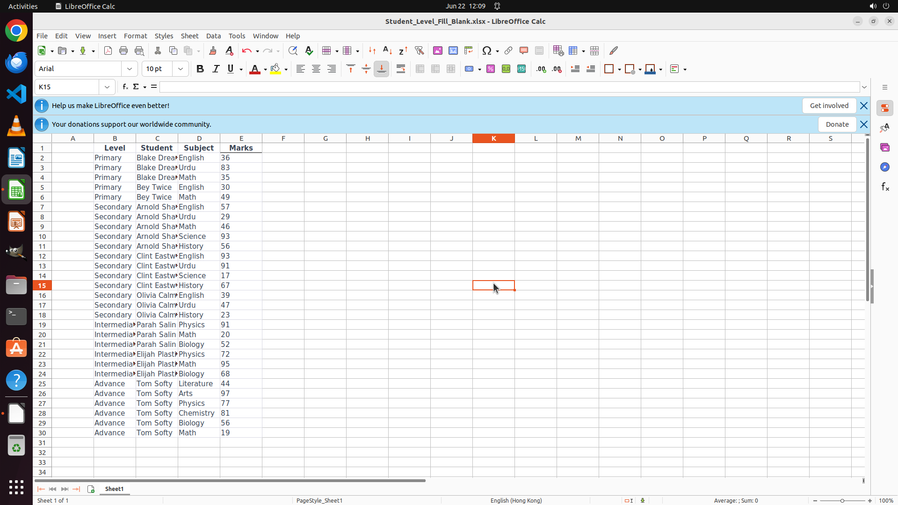

# Fill all the blank cells in B1:E30 with the value in the cell above it. Finish the work and don't to…

[← LibreOffice Calc](../README.md) · [← Showcase](../../README.md)

## Task

> Fill all the blank cells in B1:E30 with the value in the cell above it. Finish the work and don't touch irrelevant regions, even if they are blank.

## Final state

## Artifacts

- [Trajectory](traj.jsonl) — per-step actions, reasoning, and screenshots
- [Runtime log](runtime.log)
- [Task definition](task.json) — original OSWorld task config
- Step screenshots: `step_*.png` in this folder

Task ID: `01b269ae-2111-4a07-81fd-3fcd711993b0` · Domain: `libreoffice_calc` · Source: `https://www.youtube.com/shorts/VrUzPTIwQ04`
