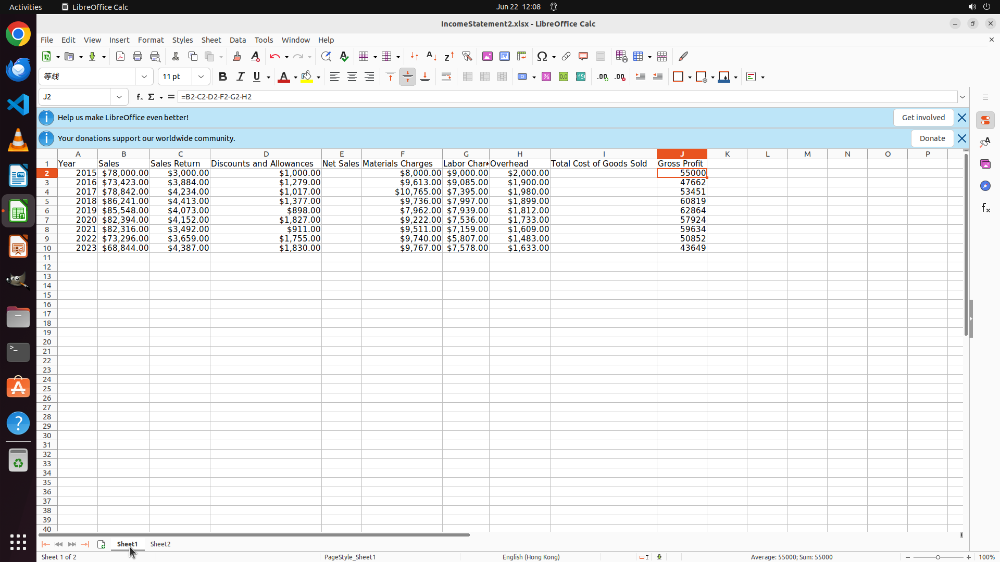

# Help me fill in the Gross profit column by subtracting all the available expenses including discount…

[← LibreOffice Calc](../README.md) · [← Showcase](../../README.md)

## Task

> Help me fill in the Gross profit column by subtracting all the available expenses including discounts, allowances, material and labor charges, and overhead from the actual sale, i.e., the sales after deducting the returns. Then under column A named "Year_Profit" in a new sheet "Sheet2", display the Year Column in Sheet 1 as text appended by a "_" with the corresponding integer digits of Gross Profit value.

## Final state

## Artifacts

- [Trajectory](traj.jsonl) — per-step actions, reasoning, and screenshots
- [Runtime log](runtime.log)
- [Task definition](task.json) — original OSWorld task config
- Step screenshots: `step_*.png` in this folder

Task ID: `035f41ba-6653-43ab-aa63-c86d449d62e5` · Domain: `libreoffice_calc` · Source: `SheetCopilot@92`
