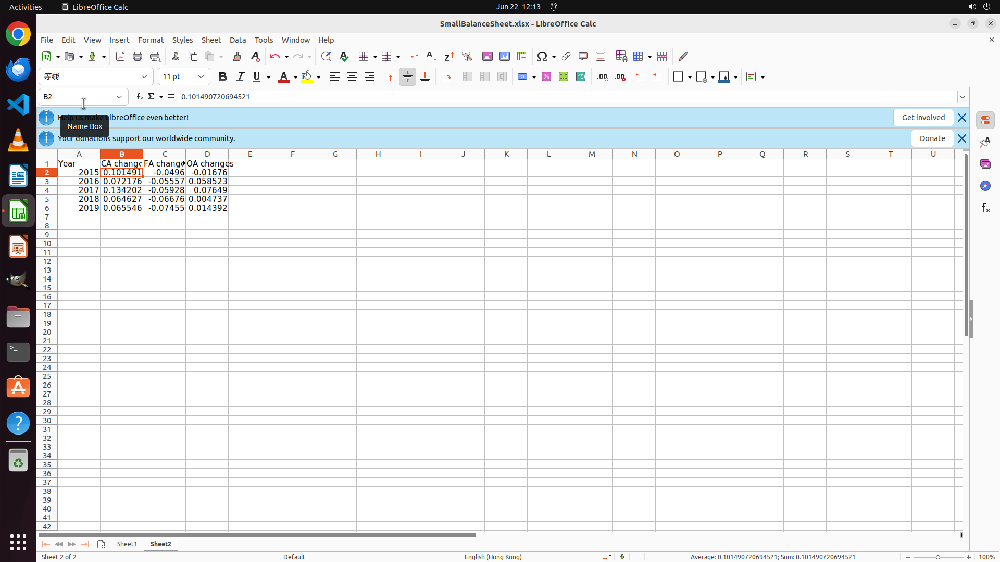

# In a new sheet ("Sheet2") with 4 headers "Year", "CA changes", "FA changes", and "OA changes", calcu…

[← LibreOffice Calc](../README.md) · [← Showcase](../../README.md)

## Task

> In a new sheet ("Sheet2") with 4 headers "Year", "CA changes", "FA changes", and "OA changes", calculate the percentage annual changes compared to last year in 2015 to 2019 for the Current Assets, Fixed Assets, and Other Assets columns.

## Final state

## Artifacts

- [Trajectory](traj.jsonl) — per-step actions, reasoning, and screenshots
- [Runtime log](runtime.log)
- [Task definition](task.json) — original OSWorld task config
- Step screenshots: `step_*.png` in this folder

Task ID: `04d9aeaf-7bed-4024-bedb-e10e6f00eb7f` · Domain: `libreoffice_calc` · Source: `SheetCopilot@168`
