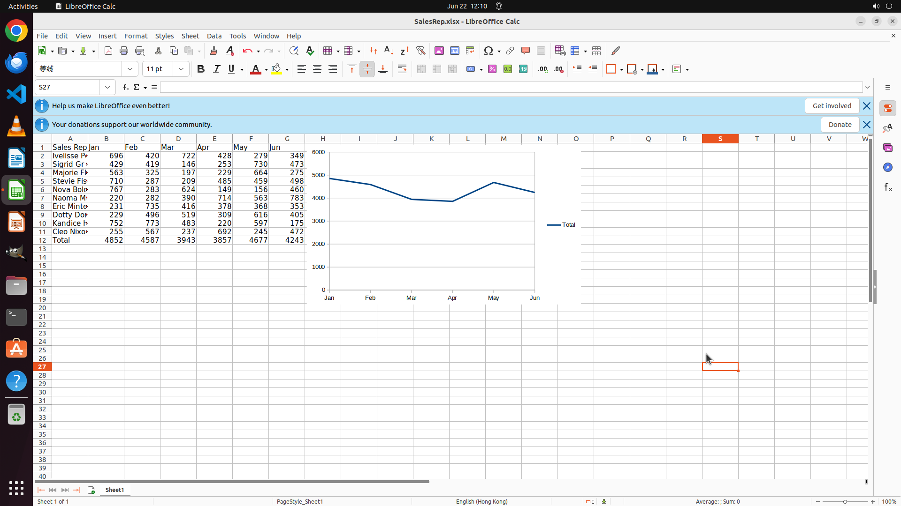

# Work out the monthly total sales in a new row called "Total" and then create a line chart to show th…

[← LibreOffice Calc](../README.md) · [← Showcase](../../README.md)

## Task

> Work out the monthly total sales in a new row called "Total" and then create a line chart to show the results (x-axis be Months).

## Final state

## Artifacts

- [Trajectory](traj.jsonl) — per-step actions, reasoning, and screenshots
- [Runtime log](runtime.log)
- [Task definition](task.json) — original OSWorld task config
- Step screenshots: `step_*.png` in this folder

Task ID: `0a2e43bf-b26c-4631-a966-af9dfa12c9e5` · Domain: `libreoffice_calc` · Source: `SheetCopilot@154`
