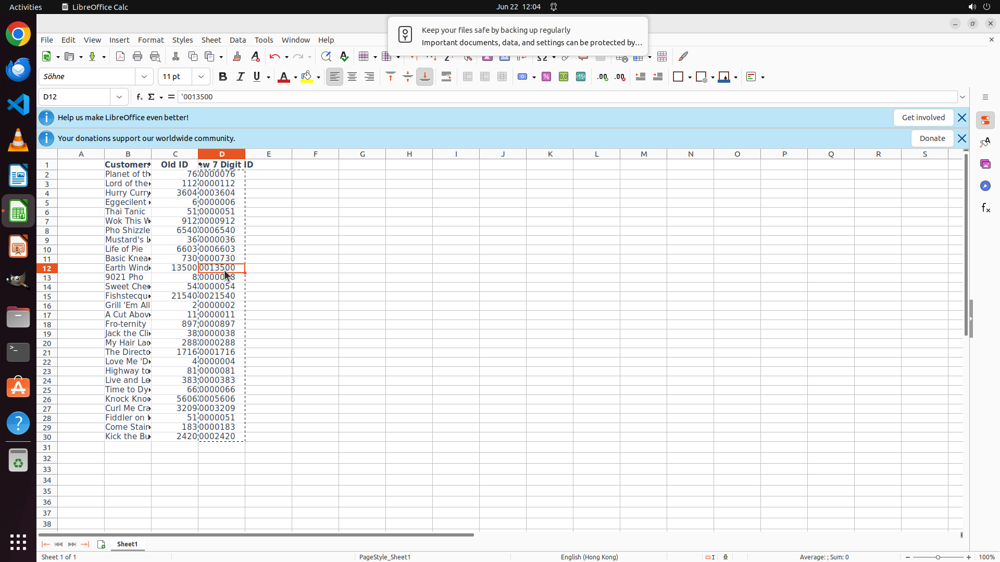

# I would like to copy all the numbers in the 'Old ID' column to the 'New 7 Digit Id' column, and pad …

[← LibreOffice Calc](../README.md) · [← Showcase](../../README.md)

## Task

> I would like to copy all the numbers in the 'Old ID' column to the 'New 7 Digit Id' column, and pad them with zeros in front, to fill them up to seven digits. Finish the work and don't touch irrelevant regions, even if they are blank.

## Final state

## Artifacts

- [Trajectory](traj.jsonl) — per-step actions, reasoning, and screenshots
- [Runtime log](runtime.log)
- [Task definition](task.json) — original OSWorld task config
- Step screenshots: `step_*.png` in this folder

Task ID: `0bf05a7d-b28b-44d2-955a-50b41e24012a` · Domain: `libreoffice_calc` · Source: `https://www.youtube.com/shorts/FPAQaDTS8VY`
