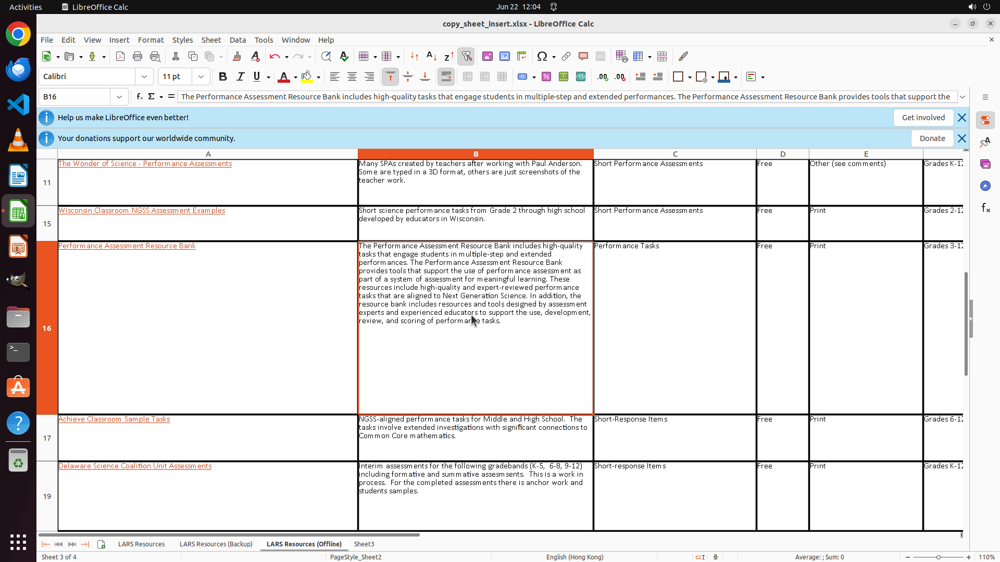

# Rename "Sheet 1" to "LARS Resources". Then make a copy of it. Place the copy before "Sheet 2" and re…

[← LibreOffice Calc](../README.md) · [← Showcase](../../README.md)

## Task

> Rename "Sheet 1" to "LARS Resources". Then make a copy of it. Place the copy before "Sheet 2" and rename it by appending a suffix "(Backup)", concatenated by a white space. And Also rename "Sheet2" to "LARS Resources (Offline)".

## Final state

## Artifacts

- [Trajectory](traj.jsonl) — per-step actions, reasoning, and screenshots
- [Runtime log](runtime.log)
- [Task definition](task.json) — original OSWorld task config
- Step screenshots: `step_*.png` in this folder

Task ID: `0cecd4f3-74de-457b-ba94-29ad6b5dafb6` · Domain: `libreoffice_calc` · Source: `https://www.libreofficehelp.com/add-insert-delete-copy-move-rename-a-worksheet-in-libreoffice-calc/`
