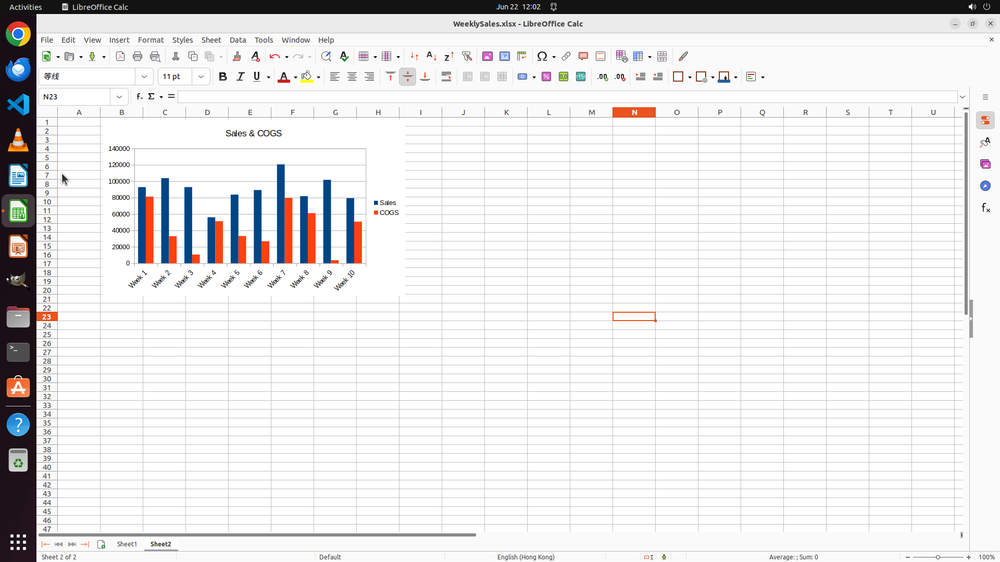

# Create a clustered column chart showing the Sales and COGS data for each week in a new sheet named "…

[← LibreOffice Calc](../README.md) · [← Showcase](../../README.md)

## Task

> Create a clustered column chart showing the Sales and COGS data for each week in a new sheet named "Sheet2". Set the chart title as "Sales & COGS".

## Final state

## Artifacts

- [Trajectory](traj.jsonl) — per-step actions, reasoning, and screenshots
- [Runtime log](runtime.log)
- [Task definition](task.json) — original OSWorld task config
- Step screenshots: `step_*.png` in this folder

Task ID: `12382c62-0cd1-4bf2-bdc8-1d20bf9b2371` · Domain: `libreoffice_calc` · Source: `SheetCopilot@210`
