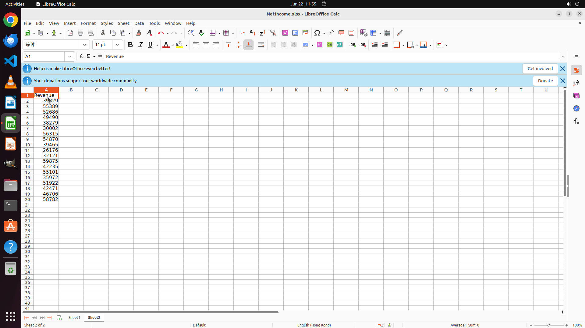

# Copy the "Revenue" column along with the header to a new sheet named "Sheet2".

[← LibreOffice Calc](../README.md) · [← Showcase](../../README.md)

## Task

> Copy the "Revenue" column along with the header to a new sheet named "Sheet2".

## Final state

## Artifacts

- [Trajectory](traj.jsonl) — per-step actions, reasoning, and screenshots
- [Runtime log](runtime.log)
- [Task definition](task.json) — original OSWorld task config
- Step screenshots: `step_*.png` in this folder

Task ID: `1273e544-688f-496b-8d89-3e0f40aa0606` · Domain: `libreoffice_calc` · Source: `SheetCopilot@123`
