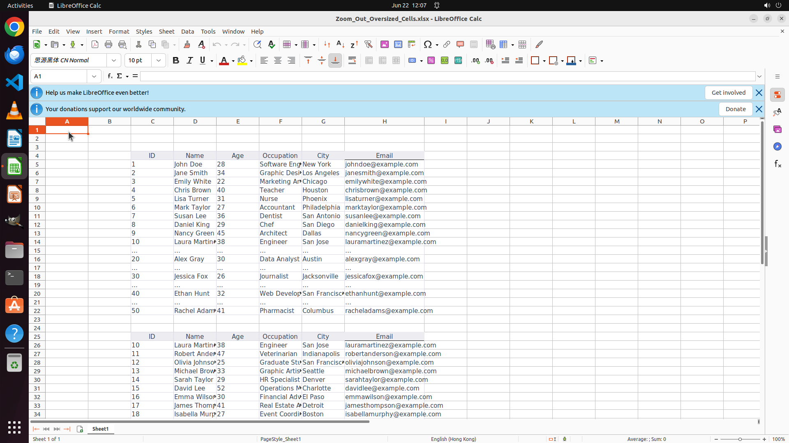

# The cells are so big that I can not click on the cell I want, zoom out a little bit.

[← LibreOffice Calc](../README.md) · [← Showcase](../../README.md)

## Task

> The cells are so big that I can not click on the cell I want, zoom out a little bit.

## Final state

## Artifacts

- [Trajectory](traj.jsonl) — per-step actions, reasoning, and screenshots
- [Runtime log](runtime.log)
- [Task definition](task.json) — original OSWorld task config
- Step screenshots: `step_*.png` in this folder

Task ID: `1334ca3e-f9e3-4db8-9ca7-b4c653be7d17` · Domain: `libreoffice_calc` · Source: `https://techcommunity.microsoft.com/t5/excel/excel-workbook-top-way-too-big-can-t-see-rows-and-columns/m-p/4014694`
