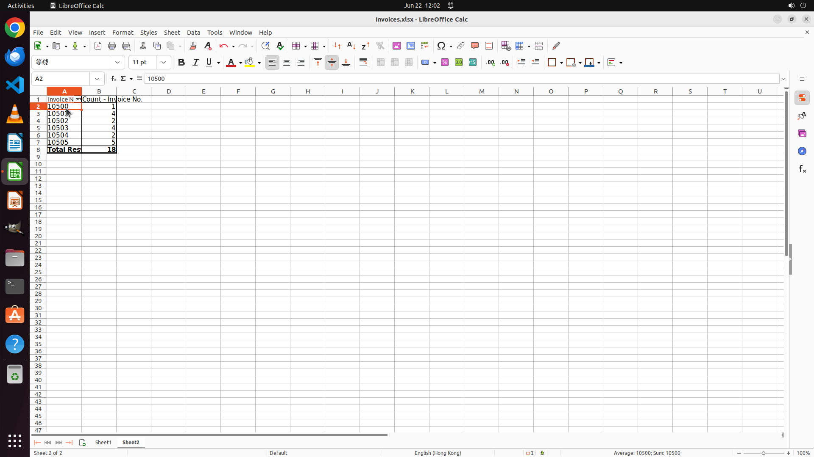

# Create a Pivot Table in a new sheet (Sheet2) to count how many times each "Invoice No." appears.

[← LibreOffice Calc](../README.md) · [← Showcase](../../README.md)

## Task

> Create a Pivot Table in a new sheet (Sheet2) to count how many times each "Invoice No." appears.

## Final state

## Artifacts

- [Trajectory](traj.jsonl) — per-step actions, reasoning, and screenshots
- [Runtime log](runtime.log)
- [Task definition](task.json) — original OSWorld task config
- Step screenshots: `step_*.png` in this folder

Task ID: `1954cced-e748-45c4-9c26-9855b97fbc5e` · Domain: `libreoffice_calc` · Source: `SheetCopilot@104`
