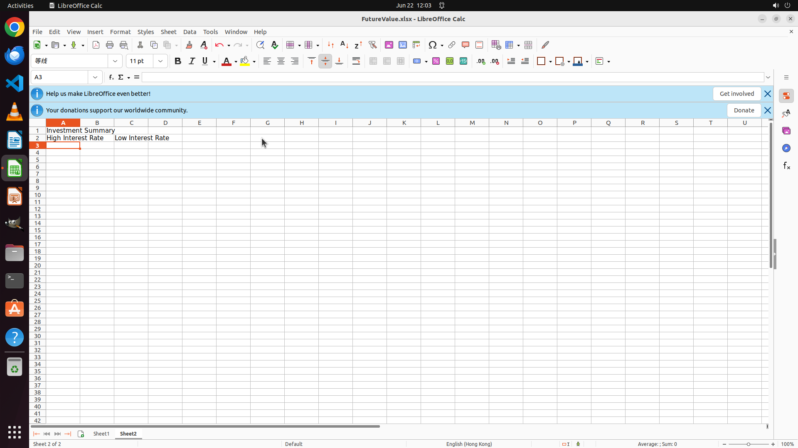

# Create a new sheet named "Sheet2" and merge cells A1:C1 to write the header "Investment Summary". Be…

[← LibreOffice Calc](../README.md) · [← Showcase](../../README.md)

## Task

> Create a new sheet named "Sheet2" and merge cells A1:C1 to write the header "Investment Summary". Beneath that, merge cells A2:B2 to write "High Interest Rate" and merge cells C2:D2 to form "Low Interest Rate".

## Final state

## Artifacts

- [Trajectory](traj.jsonl) — per-step actions, reasoning, and screenshots
- [Runtime log](runtime.log)
- [Task definition](task.json) — original OSWorld task config
- Step screenshots: `step_*.png` in this folder

Task ID: `1d17d234-e39d-4ed7-b46f-4417922a4e7c` · Domain: `libreoffice_calc` · Source: `SheetCopilot@73`
