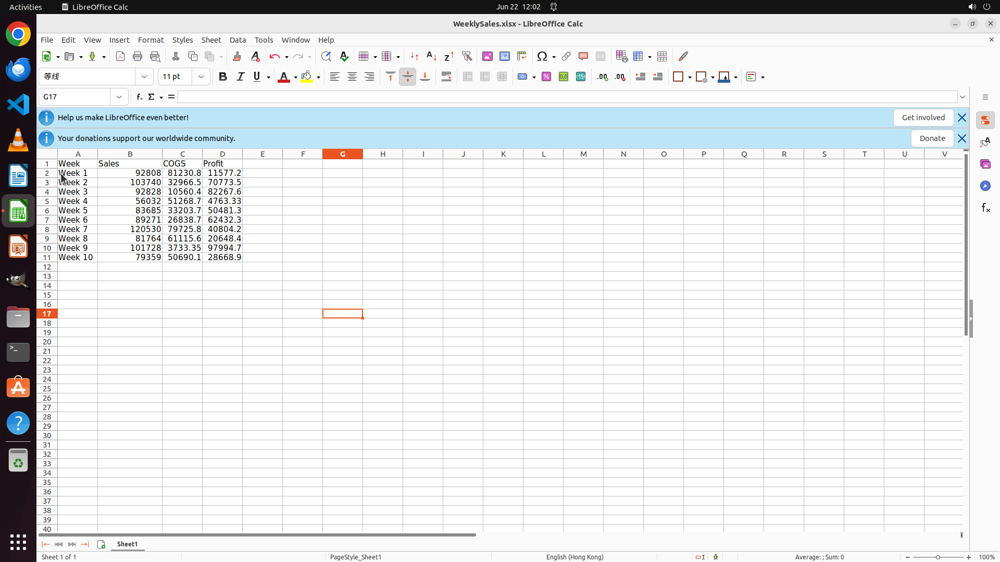

# Add a new column named "Profit" right next to the 'CGOS' column and calculate the profit for each we…

[← LibreOffice Calc](../README.md) · [← Showcase](../../README.md)

## Task

> Add a new column named "Profit" right next to the 'CGOS' column and calculate the profit for each week by subtracting "COGS" from "Sales" in that column.

## Final state

## Artifacts

- [Trajectory](traj.jsonl) — per-step actions, reasoning, and screenshots
- [Runtime log](runtime.log)
- [Task definition](task.json) — original OSWorld task config
- Step screenshots: `step_*.png` in this folder

Task ID: `1e8df695-bd1b-45b3-b557-e7d599cf7597` · Domain: `libreoffice_calc` · Source: `SheetCopilot@203`
