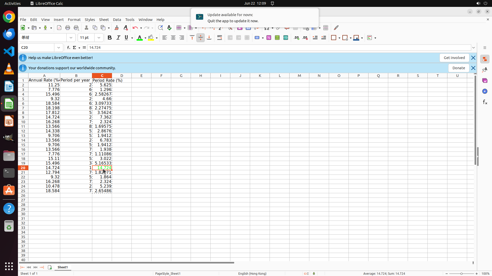

# Please calculate the period rate for my data in a new column with header "Period Rate (%)", convert …

[← LibreOffice Calc](../README.md) · [← Showcase](../../README.md)

## Task

> Please calculate the period rate for my data in a new column with header "Period Rate (%)", convert the results as number type, and highlight the highest result with green (#00ff00) font.

## Final state

## Artifacts

- [Trajectory](traj.jsonl) — per-step actions, reasoning, and screenshots
- [Runtime log](runtime.log)
- [Task definition](task.json) — original OSWorld task config
- Step screenshots: `step_*.png` in this folder

Task ID: `21ab7b40-77c2-4ae6-8321-e00d3a086c73` · Domain: `libreoffice_calc` · Source: `SheetCopilot@124`
