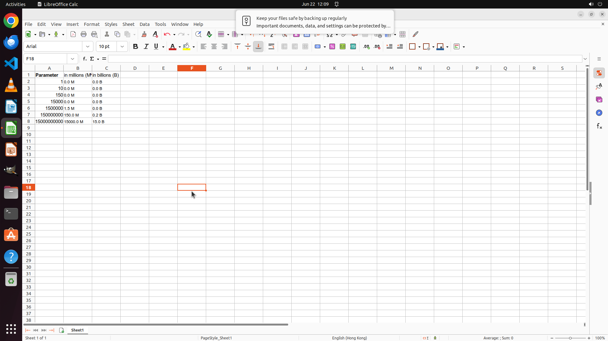

# Change the representation of column "Parameter" to show in Millions (M) in Column B and Billions (B)…

[← LibreOffice Calc](../README.md) · [← Showcase](../../README.md)

## Task

> Change the representation of column "Parameter" to show in Millions (M) in Column B and Billions (B) in Column C. The numbers should be rounded to one decimal place, and half should be rounded up. Then remember to place a white space between the digits and the unit.

## Final state

## Artifacts

- [Trajectory](traj.jsonl) — per-step actions, reasoning, and screenshots
- [Runtime log](runtime.log)
- [Task definition](task.json) — original OSWorld task config
- Step screenshots: `step_*.png` in this folder

Task ID: `21df9241-f8d7-4509-b7f1-37e501a823f7` · Domain: `libreoffice_calc` · Source: `https://www.youtube.com/watch?v=p5C4V_AO1UU`
