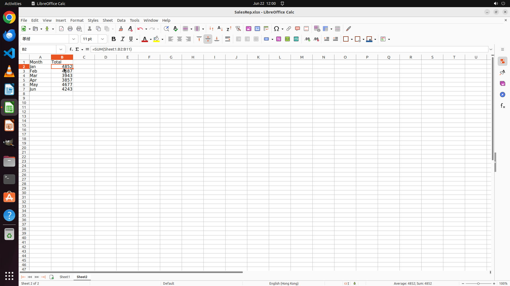

# Create a table with two column headers ("Month" and "Total") in a new sheet named "Sheet2" to show t…

[← LibreOffice Calc](../README.md) · [← Showcase](../../README.md)

## Task

> Create a table with two column headers ("Month" and "Total") in a new sheet named "Sheet2" to show the total sales for all months.

## Final state

## Artifacts

- [Trajectory](traj.jsonl) — per-step actions, reasoning, and screenshots
- [Runtime log](runtime.log)
- [Task definition](task.json) — original OSWorld task config
- Step screenshots: `step_*.png` in this folder

Task ID: `26a8440e-c166-4c50-aef4-bfb77314b46b` · Domain: `libreoffice_calc` · Source: `SheetCopilot@152`
