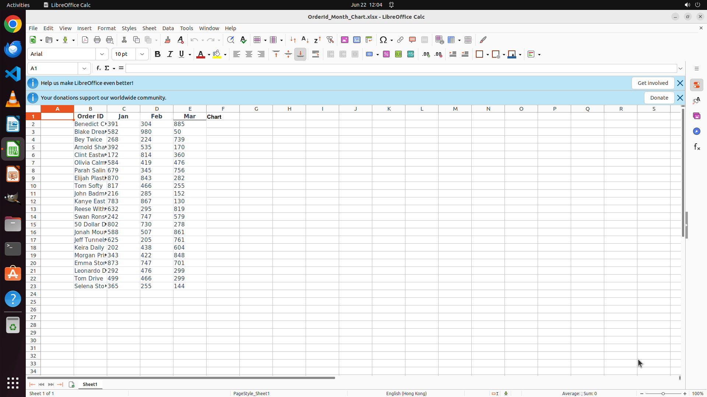

# Make sparkline charts for each order id with the data from Jan to Mar in the "Chart" column.

[← LibreOffice Calc](../README.md) · [← Showcase](../../README.md)

## Task

> Make sparkline charts for each order id with the data from Jan to Mar in the "Chart" column.

## Final state

## Artifacts

- [Trajectory](traj.jsonl) — per-step actions, reasoning, and screenshots
- [Runtime log](runtime.log)
- [Task definition](task.json) — original OSWorld task config
- Step screenshots: `step_*.png` in this folder

Task ID: `2bd59342-0664-4ccb-ba87-79379096cc08` · Domain: `libreoffice_calc` · Source: `https://www.youtube.com/shorts/L3Z-F1QTQFY`
