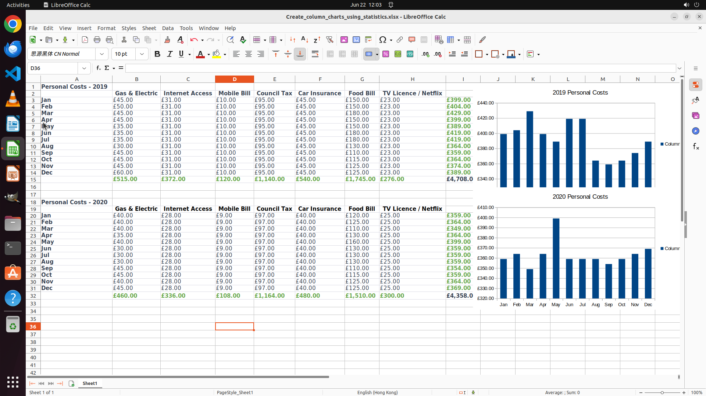

# Here are two tables recording the per-month costs in 2019 and 2020. I want to create two column bar …

[← LibreOffice Calc](../README.md) · [← Showcase](../../README.md)

## Task

> Here are two tables recording the per-month costs in 2019 and 2020. I want to create two column bar charts reflecting per-month total costs for each year from these data. Help me, Mr. Assistant!

## Final state

## Artifacts

- [Trajectory](traj.jsonl) — per-step actions, reasoning, and screenshots
- [Runtime log](runtime.log)
- [Task definition](task.json) — original OSWorld task config
- Step screenshots: `step_*.png` in this folder

Task ID: `347ef137-7eeb-4c80-a3bb-0951f26a8aff` · Domain: `libreoffice_calc` · Source: `https://www.youtube.com/watch?v=bgO40-CjYNY`
