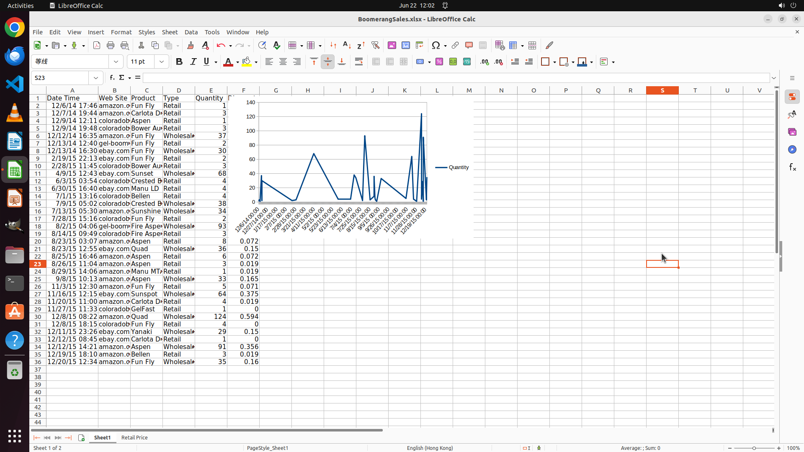

# Sort the data according to column A in an ascending order and then create a line chart with the "Dat…

[← LibreOffice Calc](../README.md) · [← Showcase](../../README.md)

## Task

> Sort the data according to column A in an ascending order and then create a line chart with the "Date Time" column on the X-axis and quantity on the Y-axis.

## Final state

## Artifacts

- [Trajectory](traj.jsonl) — per-step actions, reasoning, and screenshots
- [Runtime log](runtime.log)
- [Task definition](task.json) — original OSWorld task config
- Step screenshots: `step_*.png` in this folder

Task ID: `3a7c8185-25c1-4941-bd7b-96e823c9f21f` · Domain: `libreoffice_calc` · Source: `SheetCopilot@5`
