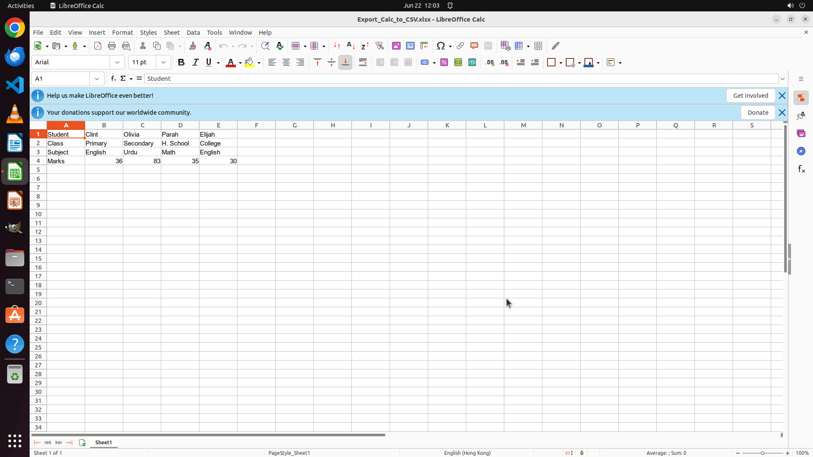

# Could you help me to export the current sheet to a csv file? Export the contents just as they are sh…

[← LibreOffice Calc](../README.md) · [← Showcase](../../README.md)

## Task

> Could you help me to export the current sheet to a csv file? Export the contents just as they are shown on the screen. Just keep the other options untouched. A default csv format is ok. The csv should share the file name with the original xlsx.

## Final state

## Artifacts

- [Trajectory](traj.jsonl) — per-step actions, reasoning, and screenshots
- [Runtime log](runtime.log)
- [Task definition](task.json) — original OSWorld task config
- Step screenshots: `step_*.png` in this folder

Task ID: `3aaa4e37-dc91-482e-99af-132a612d40f3` · Domain: `libreoffice_calc` · Source: `https://www.quora.com/How-can-you-import-export-CSV-files-with-LibreOffice-Calc-or-OpenOffice`
