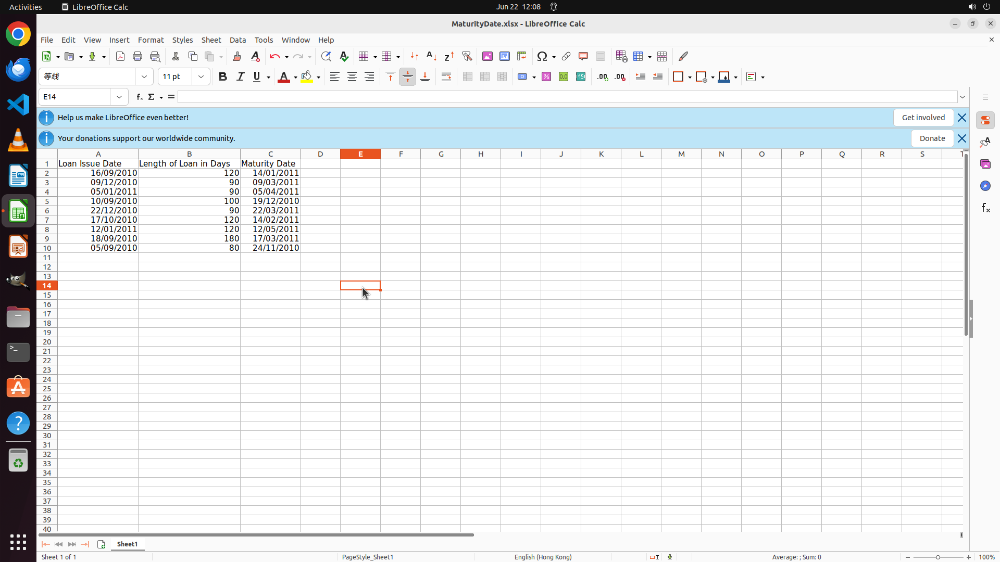

# I want to work out the maturity date for all the loans. Please do it for me in a new column with hea…

[← LibreOffice Calc](../README.md) · [← Showcase](../../README.md)

## Task

> I want to work out the maturity date for all the loans. Please do it for me in a new column with header "Maturity Date".

## Final state

## Artifacts

- [Trajectory](traj.jsonl) — per-step actions, reasoning, and screenshots
- [Runtime log](runtime.log)
- [Task definition](task.json) — original OSWorld task config
- Step screenshots: `step_*.png` in this folder

Task ID: `4172ea6e-6b77-4edb-a9cc-c0014bd1603b` · Domain: `libreoffice_calc` · Source: `SheetCopilot@113`
