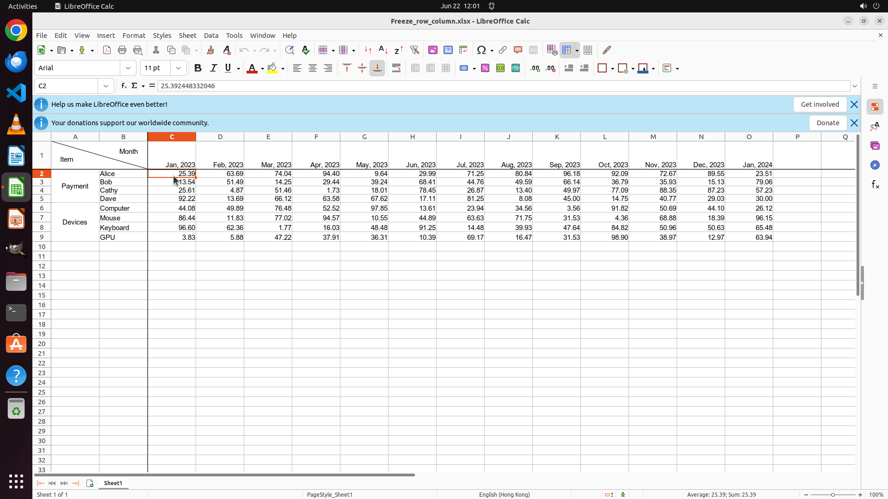

# Help me freeze the range A1:B1 on this sheet to keep the headers always visible

[← LibreOffice Calc](../README.md) · [← Showcase](../../README.md)

## Task

> Help me freeze the range A1:B1 on this sheet to keep the headers always visible

## Final state

## Artifacts

- [Trajectory](traj.jsonl) — per-step actions, reasoning, and screenshots
- [Runtime log](runtime.log)
- [Task definition](task.json) — original OSWorld task config
- Step screenshots: `step_*.png` in this folder

Task ID: `4188d3a4-077d-46b7-9c86-23e1a036f6c1` · Domain: `libreoffice_calc` · Source: `https://www.libreofficehelp.com/freeze-unfreeze-rows-columns-ranges-calc/`
