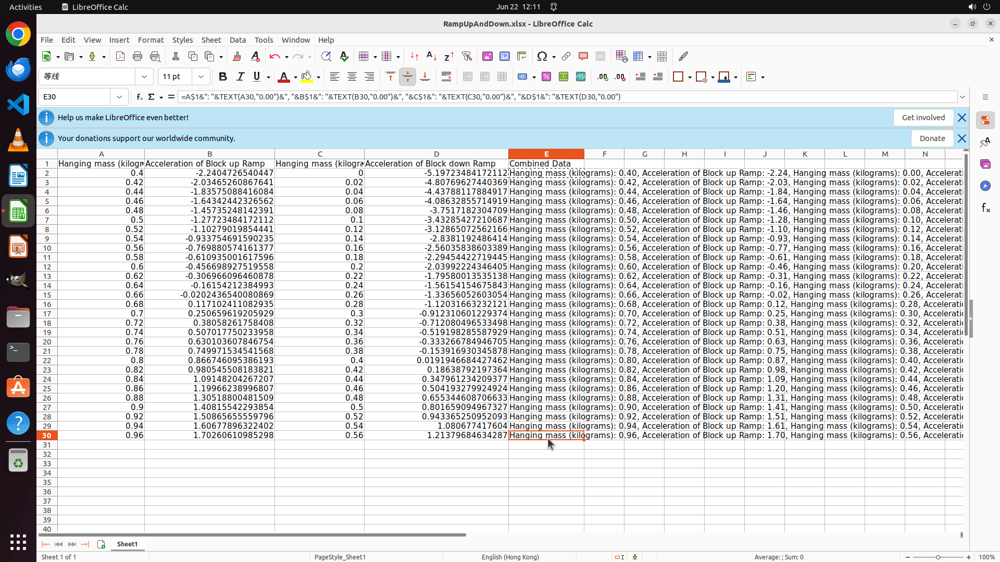

# I have compute the acceleration in row 2 and I want you to fill out other rows for column B and D. N…

[← LibreOffice Calc](../README.md) · [← Showcase](../../README.md)

## Task

> I have compute the acceleration in row 2 and I want you to fill out other rows for column B and D. Next concatenate the values from columns A to D, including their headers (the pattern is "Header: cell value, ..., Header: cell value"), into a new column named "Combined Data" for all rows. In the new column, only keep 2 decimal digits.

## Final state

## Artifacts

- [Trajectory](traj.jsonl) — per-step actions, reasoning, and screenshots
- [Runtime log](runtime.log)
- [Task definition](task.json) — original OSWorld task config
- Step screenshots: `step_*.png` in this folder

Task ID: `4de54231-e4b5-49e3-b2ba-61a0bec721c0` · Domain: `libreoffice_calc` · Source: `SheetCopilot@147`
