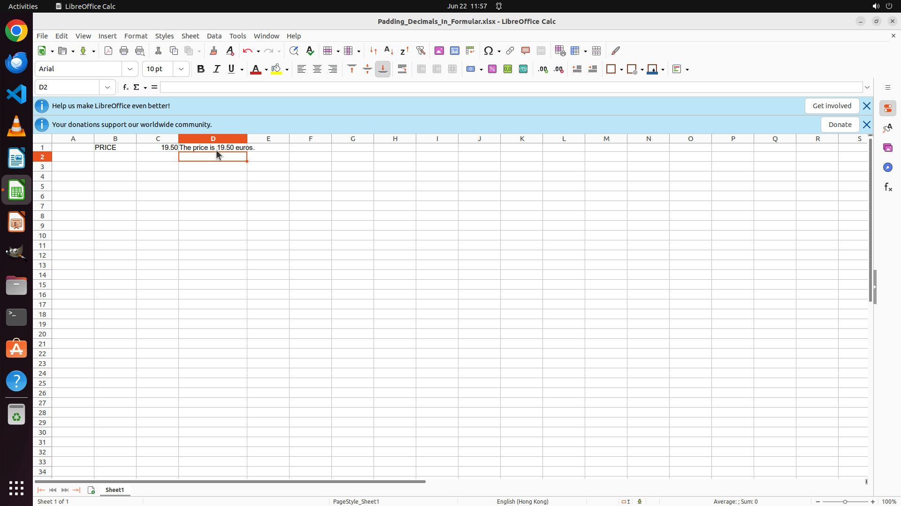

# Here I want to use the numerical value from a cell in the text. I can set its number of decimal digi…

[← LibreOffice Calc](../README.md) · [← Showcase](../../README.md)

## Task

> Here I want to use the numerical value from a cell in the text. I can set its number of decimal digits to 2 in the original value cell but don't know how to fix it in the text as well. Please help me to do this. Finish the work and don't touch irrelevant regions, even if they are blank.

## Final state

## Artifacts

- [Trajectory](traj.jsonl) — per-step actions, reasoning, and screenshots
- [Runtime log](runtime.log)
- [Task definition](task.json) — original OSWorld task config
- Step screenshots: `step_*.png` in this folder

Task ID: `4f07fbe9-70de-4927-a4d5-bb28bc12c52c` · Domain: `libreoffice_calc` · Source: `https://superuser.com/questions/1081048/libreoffice-calc-how-to-pad-number-to-fixed-decimals-when-used-within-formula`
