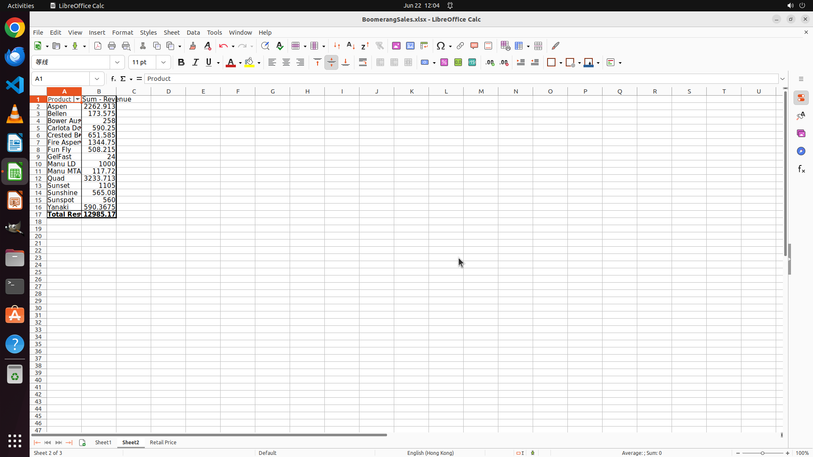

# Calculate revenue in a new column according to the Retail Price sheet (consider product price and qu…

[← LibreOffice Calc](../README.md) · [← Showcase](../../README.md)

## Task

> Calculate revenue in a new column according to the Retail Price sheet (consider product price and quantity and discount), and generate a Pivot Table in a new sheet (Sheet2) that summarizes the revenue of each product.

## Final state

## Artifacts

- [Trajectory](traj.jsonl) — per-step actions, reasoning, and screenshots
- [Runtime log](runtime.log)
- [Task definition](task.json) — original OSWorld task config
- Step screenshots: `step_*.png` in this folder

Task ID: `51719eea-10bc-4246-a428-ac7c433dd4b3` · Domain: `libreoffice_calc` · Source: `SheetCopilot@7`
