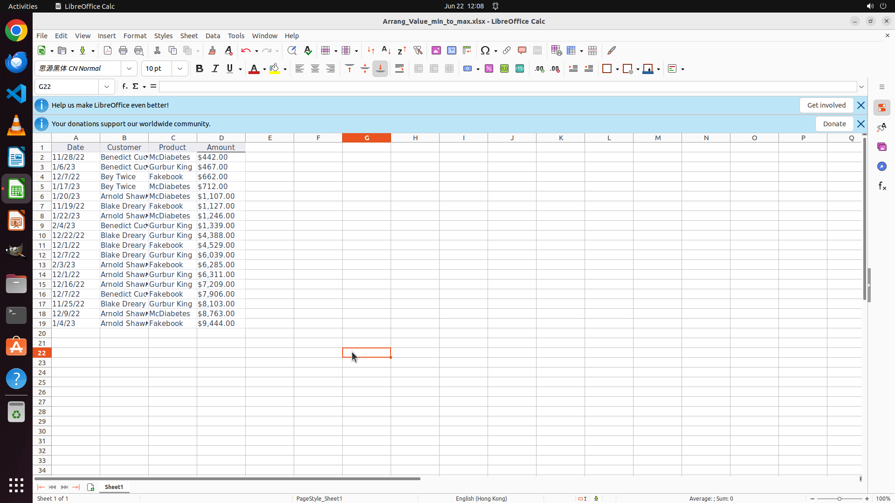

# Could you help me to sort the records accoring to the amounts ascendingly?

[← LibreOffice Calc](../README.md) · [← Showcase](../../README.md)

## Task

> Could you help me to sort the records accoring to the amounts ascendingly?

## Final state

## Artifacts

- [Trajectory](traj.jsonl) — per-step actions, reasoning, and screenshots
- [Runtime log](runtime.log)
- [Task definition](task.json) — original OSWorld task config
- Step screenshots: `step_*.png` in this folder

Task ID: `51b11269-2ca8-4b2a-9163-f21758420e78` · Domain: `libreoffice_calc` · Source: `https://www.reddit.com/r/LibreOfficeCalc/comments/186pcc6/how_to_arrange_numbers_in_a_column_from_minimum/`
