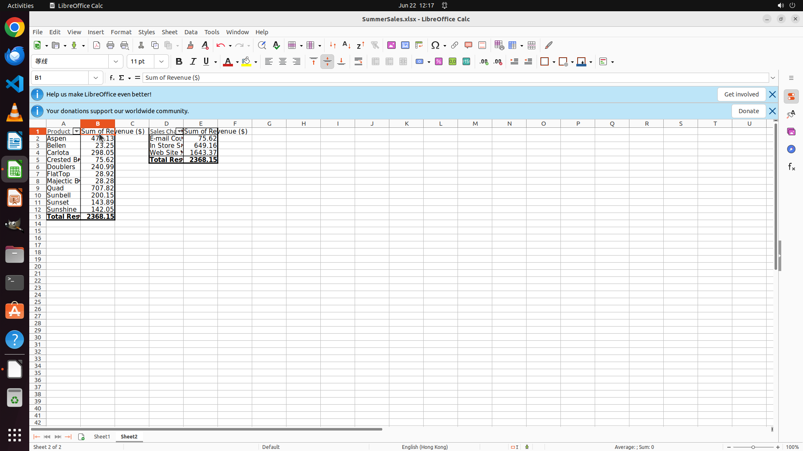

# Create two pivot tables in a new sheet named "Sheet2" showing the total revenue for each product and…

[← LibreOffice Calc](../README.md) · [← Showcase](../../README.md)

## Task

> Create two pivot tables in a new sheet named "Sheet2" showing the total revenue for each product and sales channel.

## Final state

## Artifacts

- [Trajectory](traj.jsonl) — per-step actions, reasoning, and screenshots
- [Runtime log](runtime.log)
- [Task definition](task.json) — original OSWorld task config
- Step screenshots: `step_*.png` in this folder

Task ID: `535364ea-05bd-46ea-9937-9f55c68507e8` · Domain: `libreoffice_calc` · Source: `SheetCopilot@180`
