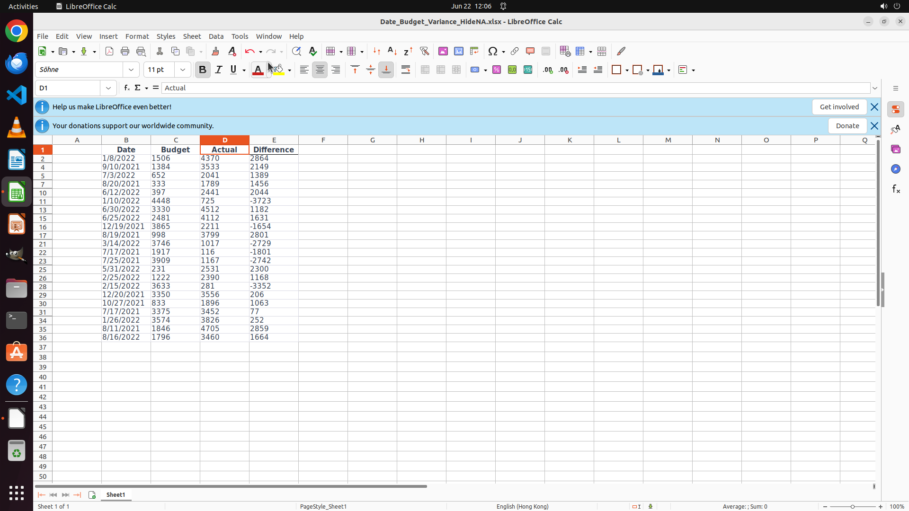

# Some data are missed by now and are filled by 'N/A' temporarily. Please hide them in the table for n…

[← LibreOffice Calc](../README.md) · [← Showcase](../../README.md)

## Task

> Some data are missed by now and are filled by 'N/A' temporarily. Please hide them in the table for now. Do not delete any cells and filter is not needed.

## Final state

## Artifacts

- [Trajectory](traj.jsonl) — per-step actions, reasoning, and screenshots
- [Runtime log](runtime.log)
- [Task definition](task.json) — original OSWorld task config
- Step screenshots: `step_*.png` in this folder

Task ID: `6054afcb-5bab-4702-90a0-b259b5d3217c` · Domain: `libreoffice_calc` · Source: `https://www.youtube.com/shorts/JTbZ8sRxkdU`
