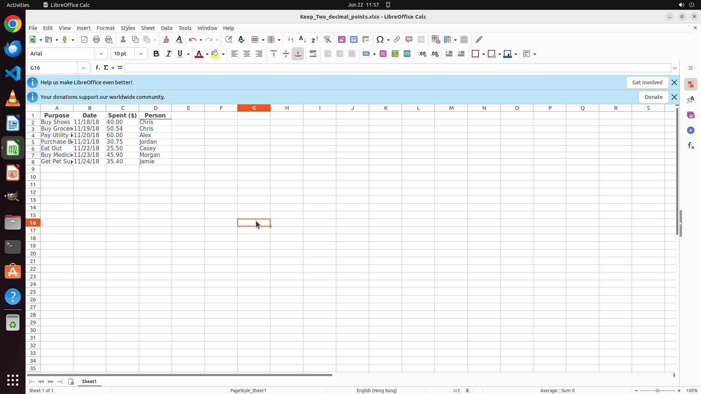

# Help me format column "spent" by keeping two decimal points.

[← LibreOffice Calc](../README.md) · [← Showcase](../../README.md)

## Task

> Help me format column "spent" by keeping two decimal points.

## Final state

## Artifacts

- [Trajectory](traj.jsonl) — per-step actions, reasoning, and screenshots
- [Runtime log](runtime.log)
- [Task definition](task.json) — original OSWorld task config
- Step screenshots: `step_*.png` in this folder

Task ID: `6e99a1ad-07d2-4b66-a1ce-ece6d99c20a5` · Domain: `libreoffice_calc` · Source: `https://www.youtube.com/watch?v=nl-nXjJurhQ`
