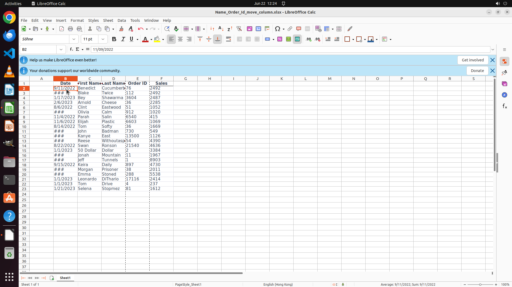

# Reorder the columns to be "Date", "First Name", "Last Name", "Order ID", "Sales". Finish the work an…

[← LibreOffice Calc](../README.md) · [← Showcase](../../README.md)

## Task

> Reorder the columns to be "Date", "First Name", "Last Name", "Order ID", "Sales". Finish the work and don't touch irrelevant regions, even if they are blank.

## Final state

## Artifacts

- [Trajectory](traj.jsonl) — per-step actions, reasoning, and screenshots
- [Runtime log](runtime.log)
- [Task definition](task.json) — original OSWorld task config
- Step screenshots: `step_*.png` in this folder

Task ID: `7a4e4bc8-922c-4c84-865c-25ba34136be1` · Domain: `libreoffice_calc` · Source: `https://www.youtube.com/shorts/bvUhr1AHs44`
