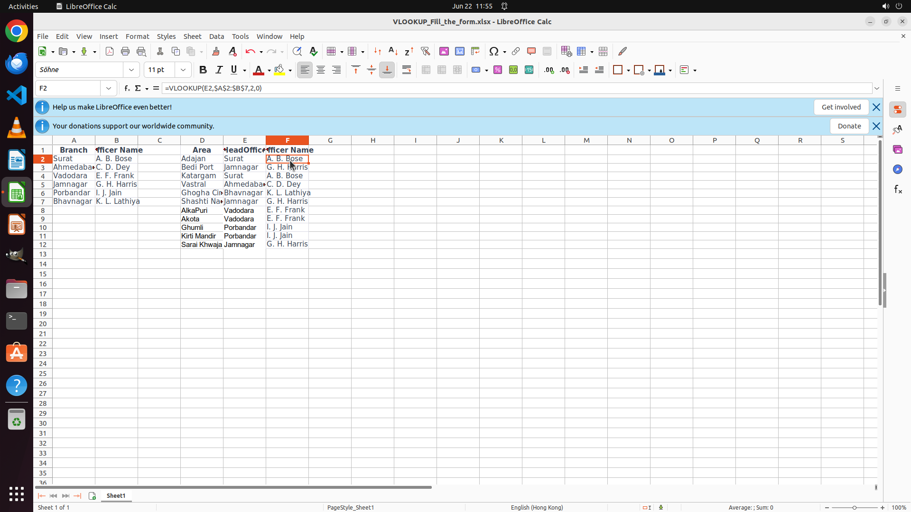

# I have a lookup table for the officers of each branch. Please, here is another table in which I need…

[← LibreOffice Calc](../README.md) · [← Showcase](../../README.md)

## Task

> I have a lookup table for the officers of each branch. Please, here is another table in which I need to fill with the officer names according the headoffice (i.e., the branch name). Help me to complete this.

## Final state

## Artifacts

- [Trajectory](traj.jsonl) — per-step actions, reasoning, and screenshots
- [Runtime log](runtime.log)
- [Task definition](task.json) — original OSWorld task config
- Step screenshots: `step_*.png` in this folder

Task ID: `7e429b8d-a3f0-4ed0-9b58-08957d00b127` · Domain: `libreoffice_calc` · Source: `https://medium.com/@divyangichaudhari17/how-to-use-vlookup-and-hlookup-in-libre-calc-3370698bb3ff`
