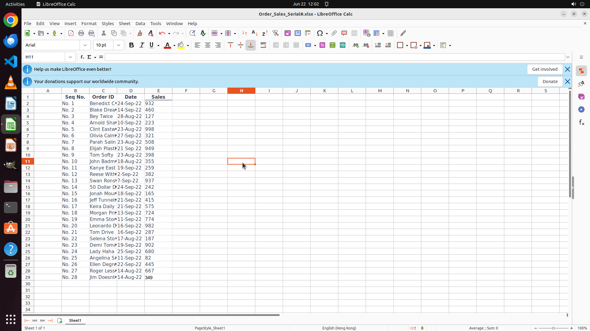

# Fill the Sequence Numbers as "No. #" in the "Seq No." column. Finish the work and don't touch irrele…

[← LibreOffice Calc](../README.md) · [← Showcase](../../README.md)

## Task

> Fill the Sequence Numbers as "No. #" in the "Seq No." column. Finish the work and don't touch irrelevant regions, even if they are blank.

## Final state

## Artifacts

- [Trajectory](traj.jsonl) — per-step actions, reasoning, and screenshots
- [Runtime log](runtime.log)
- [Task definition](task.json) — original OSWorld task config
- Step screenshots: `step_*.png` in this folder

Task ID: `7efeb4b1-3d19-4762-b163-63328d66303b` · Domain: `libreoffice_calc` · Source: `https://www.youtube.com/shorts/4jzXfZNhfmk`
