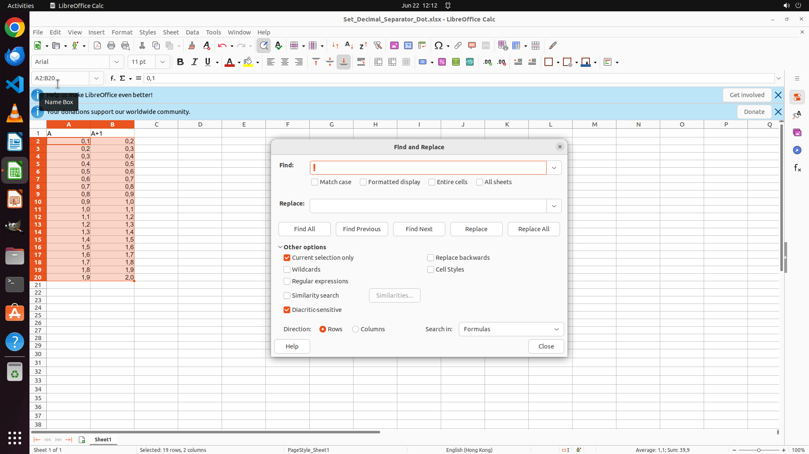

# I need to set the decimal separator as a comma (,) for localized data representation and clarity in …

[← LibreOffice Calc](../README.md) · [← Showcase](../../README.md)

## Task

> I need to set the decimal separator as a comma (,) for localized data representation and clarity in visualization. Can you help me to update all the numbers in the sheet? Also please keep the decimal numbers as-is.

## Final state

## Artifacts

- [Trajectory](traj.jsonl) — per-step actions, reasoning, and screenshots
- [Runtime log](runtime.log)
- [Task definition](task.json) — original OSWorld task config
- Step screenshots: `step_*.png` in this folder

Task ID: `a01fbce3-2793-461f-ab86-43680ccbae25` · Domain: `libreoffice_calc` · Source: `https://superuser.com/questions/1250677/how-to-set-decimal-separator-in-libre-office-calc`
