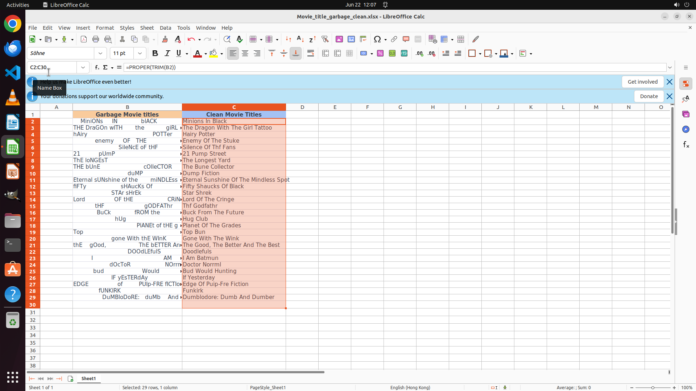

# I want to copy the movie titles in 'Garbage Movie Titles' column to the 'Clean Movie Titles' column.…

[← LibreOffice Calc](../README.md) · [← Showcase](../../README.md)

## Task

> I want to copy the movie titles in 'Garbage Movie Titles' column to the 'Clean Movie Titles' column. But please remove the adundant whitespaces and canonicalize the letter cases by capitalizing the first letter of each words and leave other letters as lower case. Finish the work and don't touch irrelevant regions, even if they are blank.

## Final state

## Artifacts

- [Trajectory](traj.jsonl) — per-step actions, reasoning, and screenshots
- [Runtime log](runtime.log)
- [Task definition](task.json) — original OSWorld task config
- Step screenshots: `step_*.png` in this folder

Task ID: `a9f325aa-8c05-4e4f-8341-9e4358565f4f` · Domain: `libreoffice_calc` · Source: `https://www.youtube.com/shorts/A0gmEBRKXWs`
