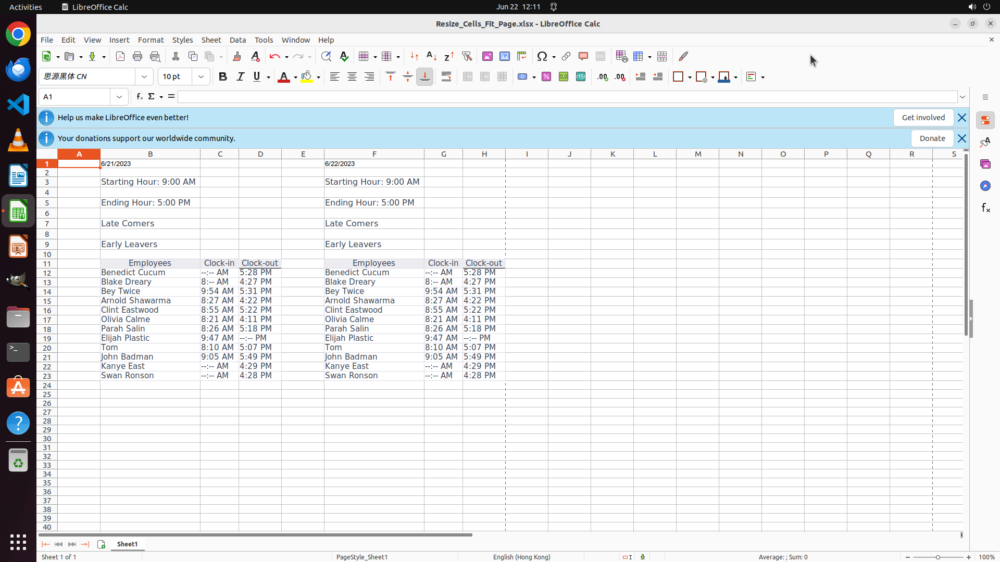

# I'm working on a project and need to resize cells in a spreadsheet to fit onto one page and export t…

[← LibreOffice Calc](../README.md) · [← Showcase](../../README.md)

## Task

> I'm working on a project and need to resize cells in a spreadsheet to fit onto one page and export to PDF for efficient presentation. Could you help me on this? Keep the name of PDF the same as the spreadsheet and place it under my home directory.

## Final state

## Artifacts

- [Trajectory](traj.jsonl) — per-step actions, reasoning, and screenshots
- [Runtime log](runtime.log)
- [Task definition](task.json) — original OSWorld task config
- Step screenshots: `step_*.png` in this folder

Task ID: `aa3a8974-2e85-438b-b29e-a64df44deb4b` · Domain: `libreoffice_calc` · Source: `https://www.quora.com/Libre-Office-Calc-How-do-I-resize-all-cells-in-a-sheet-to-make-them-fit-to-1-page-for-printing-and-exporting-as-PDF`
