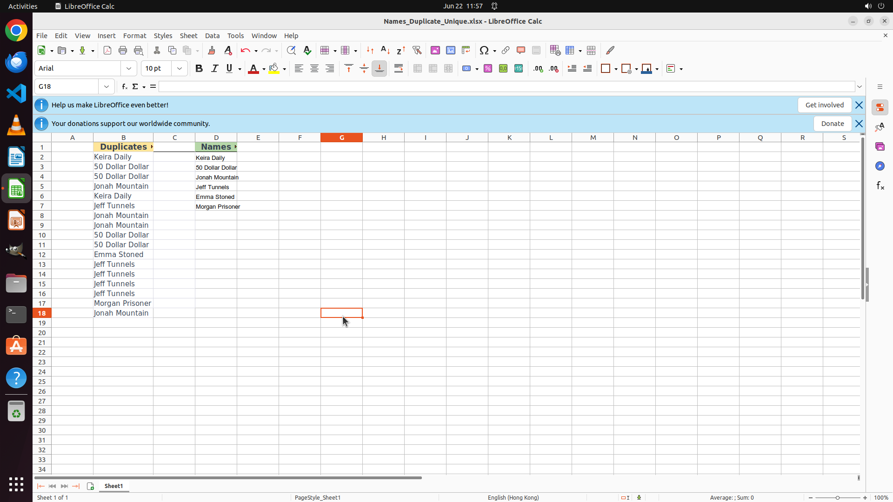

# Check the names in column "Names with duplicates" and put the unique ones in column "Unique Names". …

[← LibreOffice Calc](../README.md) · [← Showcase](../../README.md)

## Task

> Check the names in column "Names with duplicates" and put the unique ones in column "Unique Names". Keep the original order of the first occurrences. Finish the work and don't touch irrelevant regions, even if they are blank.

## Final state

## Artifacts

- [Trajectory](traj.jsonl) — per-step actions, reasoning, and screenshots
- [Runtime log](runtime.log)
- [Task definition](task.json) — original OSWorld task config
- Step screenshots: `step_*.png` in this folder

Task ID: `abed40dc-063f-4598-8ba5-9fe749c0615d` · Domain: `libreoffice_calc` · Source: `https://help.libreoffice.org/7.6/ro/text/scalc/guide/remove_duplicates.html?&DbPAR=SHARED&System=UNIX`
