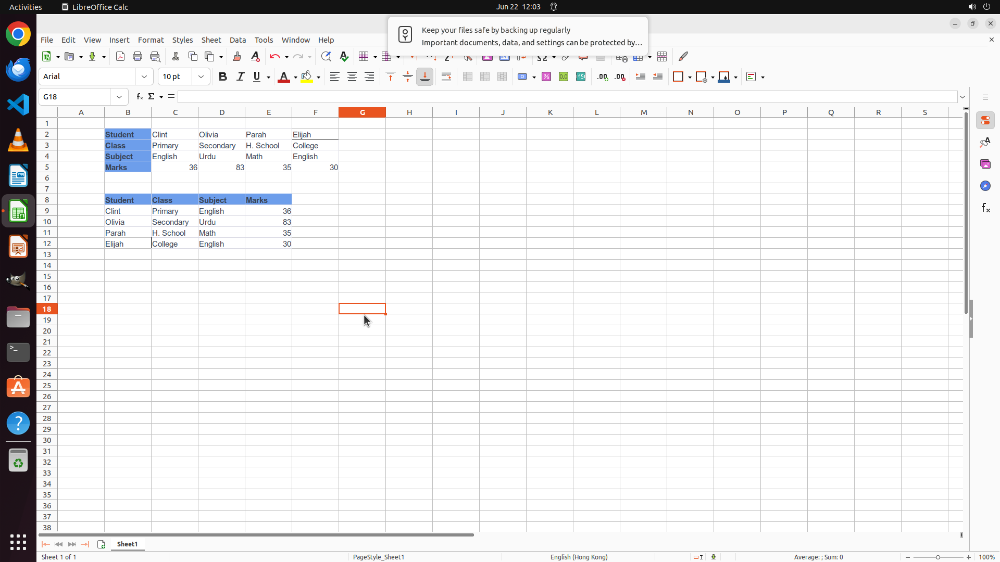

# Apply matrix transposition to the table in B2:F5 and paste the transposed table at B8 (i.e., the top…

[← LibreOffice Calc](../README.md) · [← Showcase](../../README.md)

## Task

> Apply matrix transposition to the table in B2:F5 and paste the transposed table at B8 (i.e., the top-left cell of the transposed table should be at B8)

## Final state

## Artifacts

- [Trajectory](traj.jsonl) — per-step actions, reasoning, and screenshots
- [Runtime log](runtime.log)
- [Task definition](task.json) — original OSWorld task config
- Step screenshots: `step_*.png` in this folder

Task ID: `eb03d19a-b88d-4de4-8a64-ca0ac66f426b` · Domain: `libreoffice_calc` · Source: `https://www.youtube.com/shorts/t9JLUaT55UQ`
