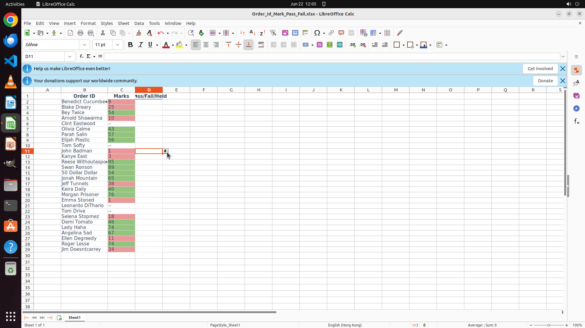

# In the column "Pass/Fail/Held", one from the texts "Pass", "Fail", and "Held" should be filled. For …

[← LibreOffice Calc](../README.md) · [← Showcase](../../README.md)

## Task

> In the column "Pass/Fail/Held", one from the texts "Pass", "Fail", and "Held" should be filled. For convinience, enable data validation for the cells in this column so that the texts to fill can be directly selected from a drop down list. Finish the work and don't touch irrelevant regions, even if they are blank.

## Final state

## Artifacts

- [Trajectory](traj.jsonl) — per-step actions, reasoning, and screenshots
- [Runtime log](runtime.log)
- [Task definition](task.json) — original OSWorld task config
- Step screenshots: `step_*.png` in this folder

Task ID: `ecb0df7a-4e8d-4a03-b162-053391d3afaf` · Domain: `libreoffice_calc` · Source: `https://www.youtube.com/shorts/tXOovKn0H68`
