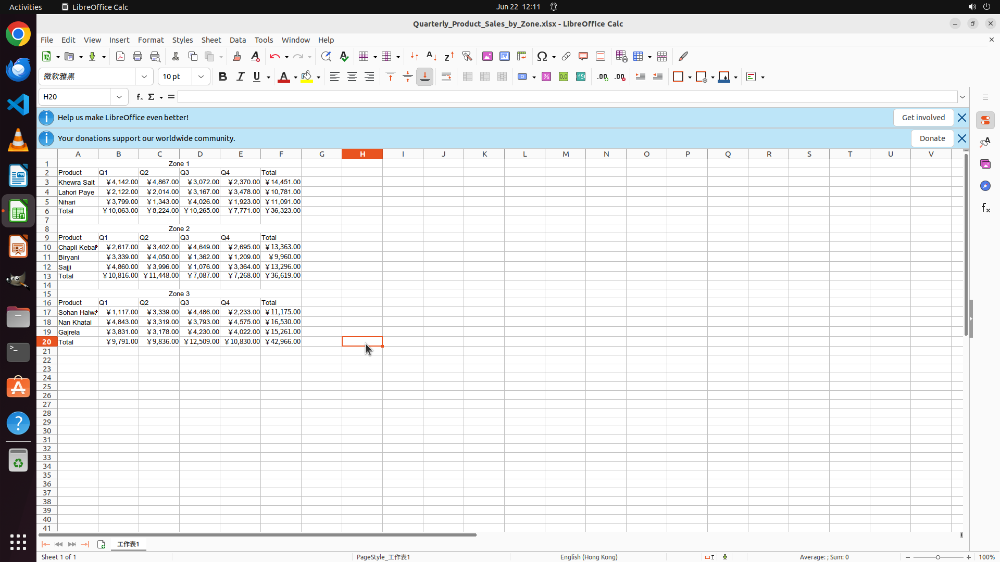

# Fill the missing rows and columns which show the total value

[← LibreOffice Calc](../README.md) · [← Showcase](../../README.md)

## Task

> Fill the missing rows and columns which show the total value

## Final state

## Artifacts

- [Trajectory](traj.jsonl) — per-step actions, reasoning, and screenshots
- [Runtime log](runtime.log)
- [Task definition](task.json) — original OSWorld task config
- Step screenshots: `step_*.png` in this folder

Task ID: `f9584479-3d0d-4c79-affa-9ad7afdd8850` · Domain: `libreoffice_calc` · Source: `https://youtube.com/shorts/feldd-Pn48c?si=9xJiem2uAHm6Jshb`
