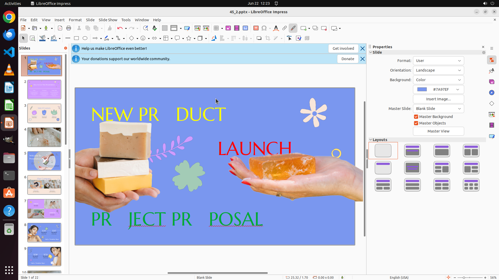

# Change the text color in the textboxes to on slide 1 yellow, red, and green, respectively, in top-to…

[← LibreOffice Impress](../README.md) · [← Showcase](../../README.md)

## Task

> Change the text color in the textboxes to on slide 1 yellow, red, and green, respectively, in top-to-bottom order. Use exactly these colors—no variations (e.g., no dark red, light green, etc.).

## Final state

## Artifacts

- [Trajectory](traj.jsonl) — per-step actions, reasoning, and screenshots
- [Runtime log](runtime.log)
- [Task definition](task.json) — original OSWorld task config
- Step screenshots: `step_*.png` in this folder

Task ID: `04578141-1d42-4146-b9cf-6fab4ce5fd74` · Domain: `libreoffice_impress` · Source: `https://arxiv.org/pdf/2311.01767.pdf`
