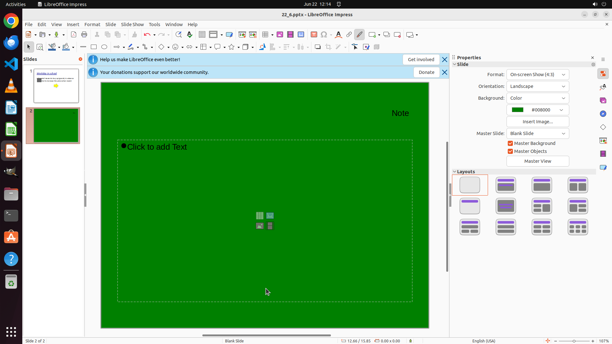

# Give the slide 2 the right aligned title, "Note".

[← LibreOffice Impress](../README.md) · [← Showcase](../../README.md)

## Task

> Give the slide 2 the right aligned title, "Note".

## Final state

## Artifacts

- [Trajectory](traj.jsonl) — per-step actions, reasoning, and screenshots
- [Runtime log](runtime.log)
- [Task definition](task.json) — original OSWorld task config
- Step screenshots: `step_*.png` in this folder

Task ID: `08aced46-45a2-48d7-993b-ed3fb5b32302` · Domain: `libreoffice_impress` · Source: `https://arxiv.org/pdf/2311.01767.pdf`
