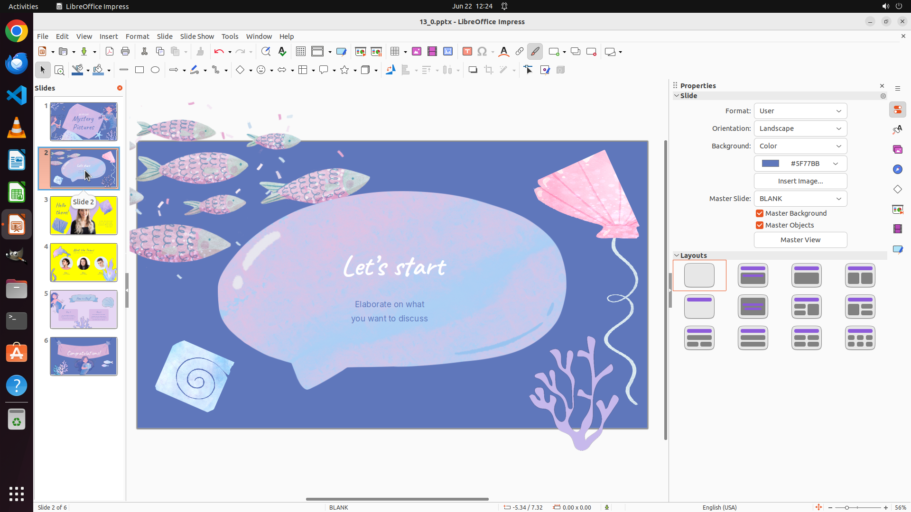

# Set the background color to yellow for any slide that contains one or more images of real people, an…

[← LibreOffice Impress](../README.md) · [← Showcase](../../README.md)

## Task

> Set the background color to yellow for any slide that contains one or more images of real people, and set the title of slide 2 as "Let's start".

## Final state

## Artifacts

- [Trajectory](traj.jsonl) — per-step actions, reasoning, and screenshots
- [Runtime log](runtime.log)
- [Task definition](task.json) — original OSWorld task config
- Step screenshots: `step_*.png` in this folder

Task ID: `0a211154-fda0-48d0-9274-eaac4ce5486d` · Domain: `libreoffice_impress` · Source: `https://arxiv.org/pdf/2311.01767.pdf`
