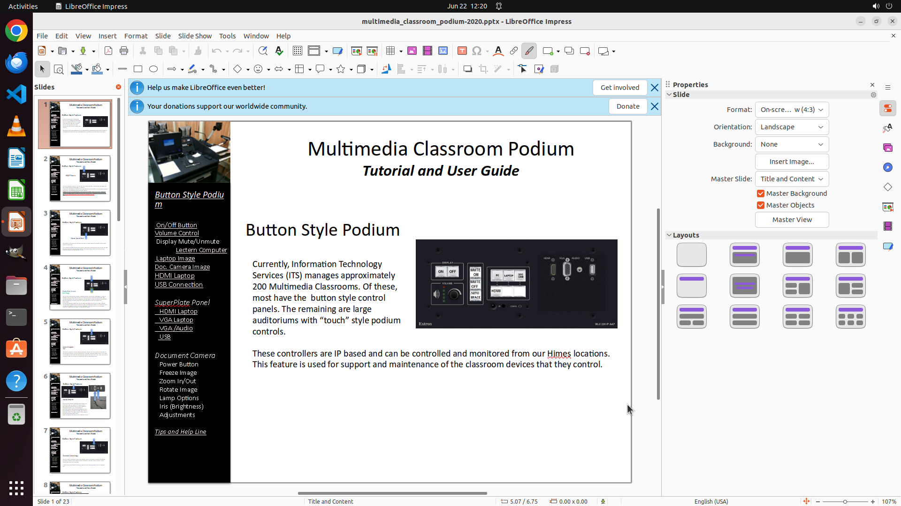

# On it Whenever I launch a LibreOffice Impress, it uses both screens, one for current slide and next …

[← LibreOffice Impress](../README.md) · [← Showcase](../../README.md)

## Task

> On it Whenever I launch a LibreOffice Impress, it uses both screens, one for current slide and next slide and another for actual presentation. What I want is to use only one monitor which shows presentation. I dont want the screen with Current slide and Next slide so that it can be used for other purposes. How should I achieve this?

## Final state

## Artifacts

- [Trajectory](traj.jsonl) — per-step actions, reasoning, and screenshots
- [Runtime log](runtime.log)
- [Task definition](task.json) — original OSWorld task config
- Step screenshots: `step_*.png` in this folder

Task ID: `0f84bef9-9790-432e-92b7-eece357603fb` · Domain: `libreoffice_impress` · Source: `https://stackoverflow.com/questions/29036788/how-to-disable-libreoffice-impress-to-use-multiple-display`
